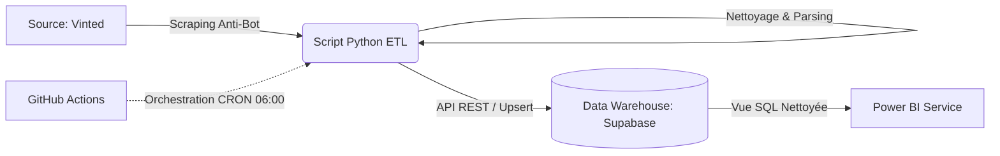

#  Strategic Pricing Monitor – Data Engineering Pipeline

   

## 📋 À propos du projet

Ce projet est une solution **End-to-End de Market Intelligence** conçue pour surveiller le marché de la seconde main (Vinted) en temps réel.

Contrairement à un simple scraper, il s'agit d'un **pipeline de données complet** qui structure une information brute pour répondre à des problématiques Business :
* **Pricing Strategy :** Analyser la décote des marques (Prix Neuf vs Occasion).
* **Market Trends :** Identifier les marques les plus liquides et les plus volatiles.
* **Opportunités :** Détection automatique d'articles sous-cotés (arbitrage).

---
## 🏗️ Architecture Technique

Le pipeline est entièrement automatisé, hébergé dans le Cloud, et suit l'architecture ELT moderne.

## 🚀 Fonctionnalités Clés & Défis Techniques

### 1. Ingestion & Contournement Anti-Bot (Extract)
* **Challenge :** Vinted utilise des protections avancées (Cloudflare/Datadome) et cache les données dans le DOM.
* **Solution :** Implémentation de `SeleniumBase` en mode *undetected* (UC Mode) couplé à `BeautifulSoup` pour un parsing hybride rapide et résilient.

### 2. Transformation & Qualité des Données (Transform)
* **Parsing Avancé :** Utilisation de **Regex** pour extraire proprement la Marque, la Taille et l'État depuis des titres non structurés.
* **Normalisation :** Algorithmes de nettoyage pour standardiser les tailles (`S / 36` → `S`) et les noms de marques (`zara` → `Zara`).
* **Gestion de l'Historique :** Stratégie d'**Upsert** (Update or Insert) dans PostgreSQL pour éviter les doublons tout en mettant à jour les prix.

### 3. Automatisation & CI/CD
* Le script est conteneurisé et exécuté quotidiennement via **GitHub Actions**.
* Utilisation de **Xvfb** (écran virtuel) pour simuler un affichage réel dans un environnement Linux headless.

### 4. Visualisation (Power BI)
* Connexion directe à la base de données PostgreSQL.
* Création de mesures DAX pour analyser la dispersion des prix et la valeur résiduelle.

---

## 🛠️ Stack Technique

| Domaine | Outils |
| :--- | :--- |
| **Langage** | Python 3.10 |
| **Scraping** | SeleniumBase, BeautifulSoup4, Requests |
| **Database** | PostgreSQL (Supabase) |
| **Orchestration** | GitHub Actions (CRON) |
| **DevOps** | Git, Environnement Virtuel (venv) |
| **BI** | Microsoft Power BI |
